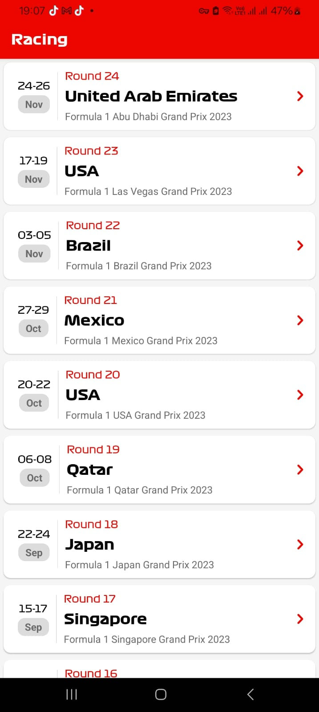
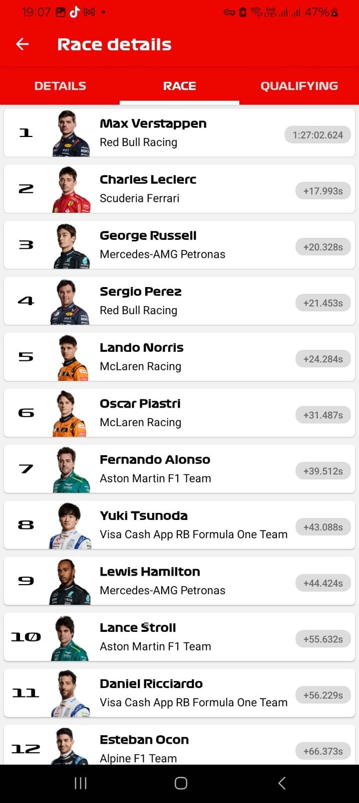

```markdown
# F1 Project

## Overview

The **F1 Project** is a mobile application built using **Expo** and **React Native** that integrates with the **api-sports.io** API. The app is designed to display data related to Formula 1, including drivers, races, and tracks. The project was created solely for learning purposes to explore mobile development, API integration, and React Native technologies.

This app fetches live data about F1 drivers, races, tracks, and more, providing an immersive experience for users interested in motorsports. It serves as an educational tool to study how to work with APIs and mobile application development.

## Preview

### Image 1


### Image 2


## Features

- **API Integration**: Utilizes the **api-sports.io** API to fetch real-time data about Formula 1 drivers, tracks, and race details.
- **Cross-Platform Support**: Built with Expo, the app works seamlessly on both Android and iOS platforms.
- **React Navigation**: Implements **Material Top Tabs** for easy navigation between different sections of the app.
- **Dynamic Content**: Displays live updates on F1 races, including driver rankings and race details.
- **Expo Managed Workflow**: Fully integrated with the **Expo** ecosystem for easy development and deployment.

## Learning Objectives

This project was created for educational purposes. It focuses on using modern technologies like **React Native**, **Expo**, **GraphQL**, and **API Integration** to build mobile apps. The goal is to understand how to fetch and display data in a mobile app while learning the tools and practices of mobile development.

### Key Technologies Used:
- **Expo**: For building cross-platform mobile apps.
- **React Navigation**: For handling navigation between different app screens.
- **api-sports.io**: To fetch live Formula 1 data.
- **React Native**: The core framework for developing the mobile app.
- **TypeScript**: Ensures type safety throughout the codebase.
- **Day.js**: For efficient date and time manipulation.

## Installation

To get started with the project locally, follow these steps:

1. Clone the repository:
   ```bash
   git clone https://github.com/joseook/f1-project.git
   cd f1-project
   ```

2. Install dependencies:
   ```bash
   npm install
   ```

3. Run the project in development mode:
   - For Android:
     ```bash
     expo start --android
     ```
   - For iOS:
     ```bash
     expo start --ios
     ```

4. Or for web:
   ```bash
   expo start --web
   ```

## APK Build

The project includes an APK build for Android that can be installed directly on devices. You can download the APK from the following link:

[Download APK](https://github.com/joseook/f1-project/releases)

## Contributing

This project is intended for learning purposes. However, if you would like to contribute, feel free to open an issue or submit a pull request.

## License

This project is licensed under the MIT License - see the [LICENSE](LICENSE) file for details.

## Acknowledgements

- **api-sports.io** for providing the Formula 1 data API.
- **Expo** and **React Native** for enabling cross-platform mobile app development.
- **React Navigation** for managing navigation in the app.
- **TypeScript** for maintaining a type-safe codebase.
```
